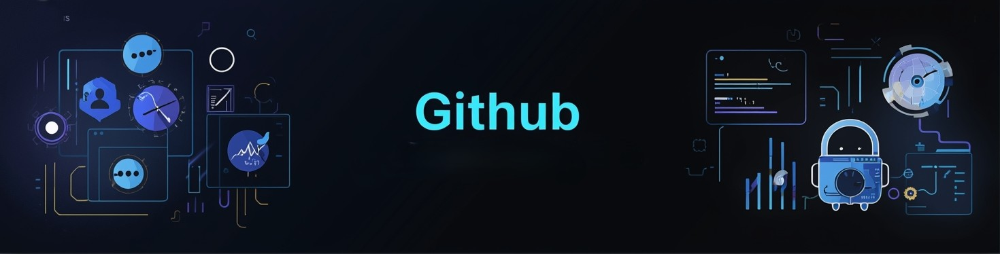

<div align="center">



<br>

<!-- HEADER TYPING SVG -->


<p><i>Crafting digital experiences with precision and elegance.</i></p>

<br>

<!-- MASTER BADGES -->
<p>
  
  
  
</p>

</div>

---

## 🎯 Development Philosophy

> *"I don't just write code; I craft solutions. Every line tells a story, every function serves a purpose, and every application reflects thoughtful design."*

---

## 🛠 Core Expertise

<div align="center">

| **Frontend Artistry** | **Backend Engineering** | **DevOps & Tools** |
|----------------------|-------------------------|--------------------|
| React • Next.js • TS | Node.js • Python • Java | Docker • AWS • Git |
| Vue • Angular • Svelte | Express • Django • Spring | K8s • Jenkins |
| Tailwind • SCSS • Framer | PostgreSQL • MongoDB • Redis | GitHub Actions |

</div>

---

## 🌟 Signature Projects

### 🎨 **Elegant UI System**
*A comprehensive design system built with React & TypeScript.*

- ✨ **60+ components**
- ♿ Full accessibility
- 🌙 Dark mode  
**Tech:** React, TS, Storybook, Styled Components  
<p align="center">
  
  
</p>

---

### ⚡ **Performance Analytics**
Real-time performance monitoring suite.

- 📈 Live Metrics  
- 🧠 Automated Insights  
- 📊 Custom Dashboards  
**Tech:** Node.js, WebSocket, D3.js, PostgreSQL

---

### 🔧 **DevOps Automation**
CI/CD pipeline optimization suite.

- 🚀 Auto-scaling  
- 🔐 Security scanning  
- 🌐 Multi-environment  
**Tech:** Docker, Kubernetes, GitHub Actions, AWS  
<p align="center">
  
  
</p>

---

## 📊 Development Rhythm


<div align="center">

## 🛠 Technology Stack

<div style="display: grid; grid-template-columns: repeat(auto-fit, minmax(120px, 1fr)); gap: 1rem; margin: 2rem 0; max-width: 700px;">

<div style="text-align: center; padding: 1rem; border: 2px solid #2E8B57; border-radius: 10px;">
  <div style="font-size: 2rem;">⚛️</div>
  <div style="color: #2E8B57; font-weight: bold;">React</div>
</div>

<div style="text-align: center; padding: 1rem; border: 2px solid #228B22; border-radius: 10px;">
  <div style="font-size: 3rem;">🟢</div>
  <div style="color: #228B22; font-weight: bold;">Node.js</div>
</div>

<div style="text-align: center; padding: 1rem; border: 2px solid #32CD32; border-radius: 10px;">
  <div style="font-size: 3rem;">🐍</div>
  <div style="color: #32CD32; font-weight: bold;">Python</div>
</div>

<div style="text-align: center; padding: 1rem; border: 2px solid #2E8B57; border-radius: 10px;">
  <div style="font-size: 2rem;">🗄️</div>
  <div style="color: #2E8B57; font-weight: bold;">MongoDB</div>
</div>

<div style="text-align: center; padding: 1rem; border: 2px solid #228B22; border-radius: 10px;">
  <div style="font-size: 3rem;">🐳</div>
  <div style="color: #228B22; font-weight: bold;">Docker</div>
</div>

<div style="text-align: center; padding: 1rem; border: 2px solid #32CD32; border-radius: 10px;">
  <div style="font-size: 3rem;">☁️</div>
  <div style="color: #32CD32; font-weight: bold;">AWS</div>
</div>

</div>

</div>


</div>

<!-- Streak Stats -->


</div>

---

## 🎯 Technical Mastery

```ts
interface DeveloperSkills {
  frontend: {
    frameworks: ['React', 'Vue', 'Angular'],
    styling: ['Tailwind', 'CSS-in-JS', 'SCSS'],
    stateManagement: ['Redux', 'Context', 'Zustand']
  };
  backend: {
    languages: ['JavaScript', 'Python', 'Java'],
    frameworks: ['Node.js', 'Express', 'Django'],
    databases: ['PostgreSQL', 'MongoDB', 'Redis']
  };
  devOps: {
    containers: ['Docker', 'Kubernetes'],
    cloud: ['AWS', 'Vercel', 'Netlify'],
    automation: ['GitHub Actions', 'Jenkins']
  };
  principles: [
    'Clean Code',
    'Test-Driven Development',
    'Performance Optimization',
    'Accessibility First'
  ];
}
```

---

## 📬 Let's Build Something Amazing

<div align="center">

<p><i>Always open to collaborations, freelance work, and visionary projects.</i></p>

<a href="mailto:anuprasadp2004@gmail.com">
  
</a>

<a href="https://linkedin.com">
  
</a>

<a href="#">
  
</a>

</div>

---

## 🎭 Beyond the Code

<div align="center">

📚 Reading philosophy & tech literature  
🎵 Curating deep-focus playlists  
☕ Exploring cafés  
🎨 Sketching UI concepts  

<br>

*"Good software is like fine craftsmanship — beautiful, functional, and built to last."*


</div>
